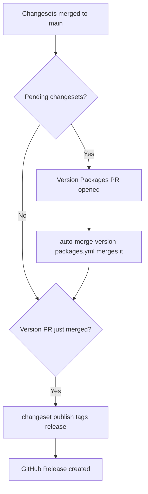

# Release Process

CareConnect uses [Semantic Versioning](https://semver.org/) and [Changesets](https://github.com/changesets/changesets) for changelog management and releases. All workspace packages share a **single version** (fixed versioning group).

Agent rules: follow [AGENTS.md](../AGENTS.md) (canonical). Also mirrored in [CLAUDE.md](../CLAUDE.md). Keep both in sync when changing agent rules.

> **Carried over from the pre-merge repos.** This repo currently ships only
> `ci.yml` and `chromatic.yml`. The release and deploy automation described
> below (`release.yml`, `auto-merge-version-packages.yml`, `cd-pipeline.yml`)
> has not been ported yet — until it is, cut releases by hand with
> `npm run version-packages` followed by `npm run release:publish`.

> **Design system versioning.** `@careconnect/design-system` joined this repo at
> `0.3.1`, carrying its own release history in
> [`packages/design-system/CHANGELOG.md`](../packages/design-system/CHANGELOG.md).
> It versions independently of the app workspaces. To fold it into the unified
> version instead, add it to `fixed` in [`.changeset/config.json`](../.changeset/config.json).

---

## Version policy

| Bump | When to use | Examples |
|------|-------------|----------|
| **Patch** | Bug fixes, docs, internal refactors with no behavior change | Fix login error, nginx template fix |
| **Minor** | New features, backward-compatible API/UI changes | New report type, walk-in flow |
| **Major** | Breaking changes | Auth model change, removed API endpoints, DB migration requiring manual steps |

The canonical version lives in the root [`package.json`](../package.json). All `@careconnect/*` workspaces stay in sync.

---

## Day-to-day development

### 1. Make your changes

Work on a feature branch as usual.

### 2. Add a changeset

For any user-facing change, run:

```bash
npm run changeset
```

- Choose **patch**, **minor**, or **major**.
- Write a short, user-facing summary (appears in `CHANGELOG.md`).
- Commit the generated file in `.changeset/` with your PR.

Skip a changeset only for internal-only work (CI tweaks, comments) with no release note.

### 3. Open a pull request

CI (`.github/workflows/ci.yml`) runs `npm ci` and `npm run build` on every PR to `main`.

### 4. Merge to `main`

After merge, the Release workflow (`.github/workflows/release.yml`) runs.

---

## How releases are cut



1. **Pending changesets** — GitHub Actions opens a **Version Packages** PR updating `CHANGELOG.md` and all `package.json` versions.
2. **Auto-merge** — `.github/workflows/auto-merge-version-packages.yml` merges the PR automatically (hourly during business hours, or on demand via `workflow_dispatch`). There is no manual review step; check `CHANGELOG.md`/the GitHub Release notes after the fact if you want to see what shipped.
3. **Publish** — Merging triggers `changeset publish`, which creates a git tag (`vX.Y.Z`) and GitHub Release (private packages are not published to npm).
4. **Deploy** — `cd-pipeline.yml` deploys every merge to `main` automatically (preprod → smoke test → prod); this is independent of whether that merge happened to also cut a tagged release.

Preview pending changesets locally:

```bash
npm run release:notes
```

---

## Conventional Commits (recommended)

Commit messages are not enforced, but this alignment helps reviewers pick the right changeset bump:

| Prefix | Typical bump |
|--------|----------------|
| `feat:` | minor |
| `fix:` | patch |
| `docs:`, `chore:`, `ci:` | patch or no changeset |
| `feat!:` or footer `BREAKING CHANGE:` | major |

---

## Hotfixes

1. Branch from `main` (or the release tag for a production hotfix).
2. Fix the issue, add a **patch** changeset.
3. Merge PR → Version Packages PR → merge → new tag (e.g. `v0.2.1`).
4. Deploy the new tag to the VM.

---

## Deploy after a release

Every merge to `main` deploys automatically via `.github/workflows/cd-pipeline.yml` (build once → deploy pre-production → smoke test → promote to production, with auto-rollback on failure) — this includes Version Packages merges, whether or not that particular merge also cut a tagged release. No manual step is needed for the normal flow.

The commands below are for a manual redeploy out-of-band (e.g. a recovery beyond what the pipeline's own auto-rollback covers). On a VM that already has CareConnect installed, `remote-install.sh` now deploys the same CI-built artifact `cd-pipeline.yml` ships to preprod/prod — it does not rebuild from source — so a manual redeploy can no longer drift from what CI validated. See [deploy/DEPLOYMENT.md](../deploy/DEPLOYMENT.md#artifact-based-deploys-ci) for details and the `--build-from-source` escape hatch.

**From your laptop (redeploy):**

```bash
./deploy/remote-install.sh --config deploy/se-tools.net.env
```

**On the VM (update in place):**

```bash
cd /opt/careconnect
sudo -u careconnect git fetch --tags
sudo -u careconnect git checkout v0.2.0   # use the new tag
sudo /opt/careconnect/deploy/update.sh
```

See [deploy/DEPLOYMENT.md](../deploy/DEPLOYMENT.md) for full deployment details.

---

## Files reference

| File | Purpose |
|------|---------|
| [`apps/api/CHANGELOG.md`](../apps/api/CHANGELOG.md) | Human-readable release history (kept current by Changesets on every release; the root [`CHANGELOG.md`](../CHANGELOG.md) predates the fixed-version monorepo setup and is no longer updated) |
| [`.changeset/config.json`](../.changeset/config.json) | Changesets configuration |
| [`.github/workflows/ci.yml`](../.github/workflows/ci.yml) | Build on PR/push |
| [`.github/workflows/chromatic.yml`](../.github/workflows/chromatic.yml) | Publishes Storybook for visual review on design system PRs |
| `.github/workflows/release.yml` | Version PR + release automation — **not yet ported to this repo** |
| `.github/workflows/auto-merge-version-packages.yml` | Auto-merges the Version Packages PR — **not yet ported to this repo** |
| `.github/workflows/cd-pipeline.yml` | Auto-deploys every merge to `main` (preprod → smoke test → prod) — **not yet ported to this repo** |
| [`deploy/fetch-ci-artifact.sh`](../deploy/fetch-ci-artifact.sh) | Downloads the latest CD Pipeline artifact for manual redeploys (used by `remote-install.sh`) |
| [`scripts/sync-root-version.mjs`](../scripts/sync-root-version.mjs) | After `changeset version`, syncs root `package.json` and README **Current version** line |

---

## Branch protection

Enabled on `main`:

- Require status check **build** (`ci.yml`) to pass before merging
- No direct pushes, force-pushes, or branch deletion (applies to admins too)
- No required review count — deliberately, so `auto-merge-version-packages.yml` can keep merging the Version Packages PR without a human approval step

This does **not** stop someone from opening a PR from a branch named `changeset-release/main` pretending to be the Changesets bot — that's a different risk, covered by the author/title check in `auto-merge-version-packages.yml` instead.

---

## First-time setup (maintainers)

Changesets and workflows are already configured. After pushing to GitHub:

1. Ensure **Actions** are enabled for the repository.
2. Merge to `main` — Release workflow needs `GITHUB_TOKEN` (provided by default).
3. Optionally create git tag `v0.2.0` manually for the baseline release if not yet tagged:

```bash
git tag v0.2.0
git push origin v0.2.0
gh release create v0.2.0 --notes-file CHANGELOG.md
```

Future releases are automated via Changesets after the Version Packages PR merges.
